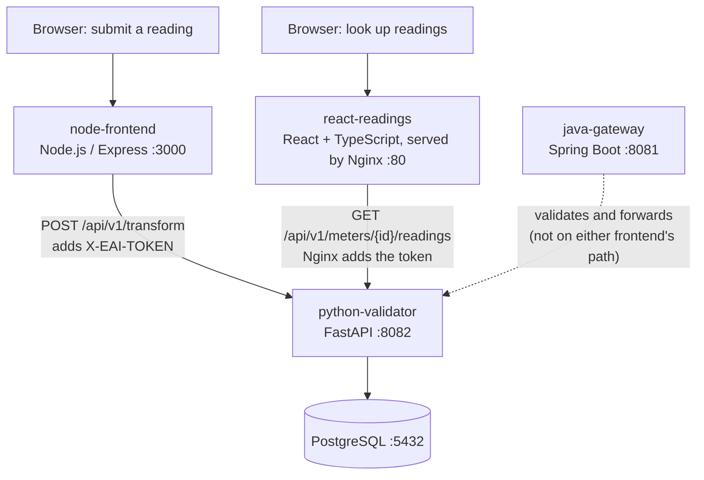
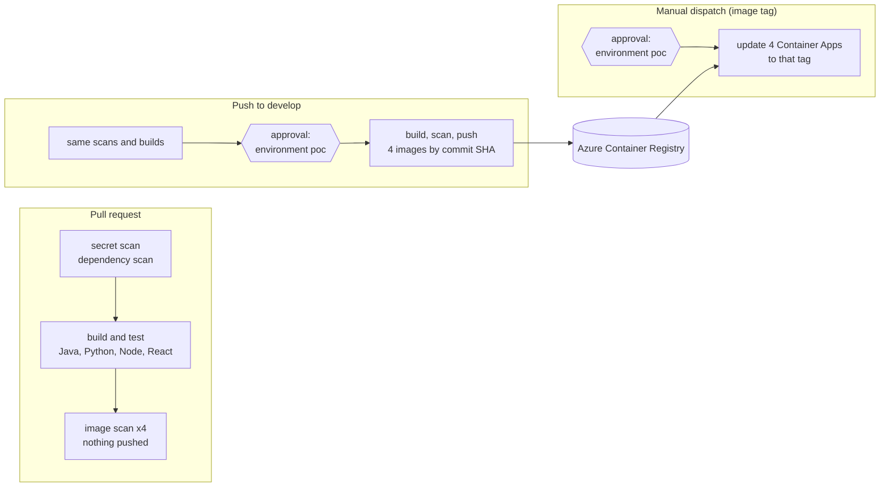

# Enterprise Integration Pipeline — Spring Boot, FastAPI, Node, React, PostgreSQL, Docker, GitHub Actions, Terraform, Azure Container Apps

> **Status: work in progress.** This repository is a hands-on proof of concept (POC) built while the author brings a long enterprise-integration background up to date with current cloud-native practice. The application layer and the Azure delivery pipeline are working end to end; testing depth, API security, the data layer and Kubernetes are planned next (see [Status and roadmap](#status-and-roadmap)). Limitations are stated openly in [Known limitations](#known-limitations).

The project implements a small smart-meter ingestion flow. A browser form (Node.js) or a Java Spring Boot gateway receives meter readings, a Python FastAPI service validates and stores them in PostgreSQL, and a React and TypeScript screen reads them back. It is deployed to Microsoft Azure Container Apps through a GitHub Actions pipeline that authenticates with workload identity federation, scans every change, and deploys by immutable image tag after a manual approval.

## What this project demonstrates

- A polyglot service set (Java 21, Python 3.14, Node 22, React and TypeScript) containerised with Docker and run locally with Docker Compose.
- A CI/CD pipeline with secret scanning, dependency scanning, image scanning, build and test, and a gated build-once, deploy-by-tag release flow.
- Infrastructure as code with Terraform on Azure, including identity bootstrap, a shared registry, and a Container Apps stack, with remote state in HCP Terraform.
- Security practice: no stored cloud credentials, managed identities, Key Vault secret references, internal-only backends, and scan gates that fail on actionable findings.
- A written paper trail: architecture decision records, C4 diagrams, an end-to-end trace of the request path, and documents that are checked against the code.

## What this project does

The runtime has two independent paths that share one backend and one database.



| Service | Folder | Role |
|---|---|---|
| `java-gateway` | `01-java-ingestion-service` | Spring Boot ingestion gateway: Bean Validation, forwards to the Python service, health check that probes the downstream service. Kept deployed and internal-only; reserved for the planned testing and API-security work. |
| `python-validator` | `02-python-transformation-api` | FastAPI service that authenticates requests, validates and stores readings, and serves the read endpoint. The only service that talks to the database. |
| `node-frontend` | `03-node-frontend` | Node.js / Express web form (the write path). Attaches the shared token and calls the Python service directly. |
| `react-readings` | `04-react-readings` | React and TypeScript read-only screen (the read path), served by Nginx, which also reverse-proxies `/api/*` to the Python service and injects the token so that no secret reaches the browser. |
| PostgreSQL | (image `postgres:16-alpine`) | Local container for development; a Container App in Azure (see [Known limitations](#known-limitations)). |

The request path was traced line by line, from startup to a stored row, in [`docs/architecture/e2e-trace.md`](docs/architecture/e2e-trace.md).

## Local quickstart

Requires Docker and Docker Compose. No Azure account is needed: this path verifies the application layer on its own.

```powershell
# PowerShell, from the repository root
Copy-Item .env.sample .env
# edit .env: set POSTGRES_PASSWORD and API_SECURITY_TOKEN to long random values

docker compose -f docker-compose.dev.yml up --build -d
docker compose -f docker-compose.dev.yml ps
```

```bash
# bash equivalent
cp .env.sample .env      # then edit the two values
docker compose -f docker-compose.dev.yml up --build -d
docker compose -f docker-compose.dev.yml ps
```

| What | Where |
|---|---|
| Submit a reading (Node form) | http://localhost:3000 |
| Look up readings (React screen) | http://localhost:8080 |
| Java gateway health | http://localhost:8081/health |
| Python service health | http://localhost:8082/health |

Calling the gateway directly (the frontends bypass it):

```bash
curl -X POST http://localhost:8081/api/v1/ingest/bulk \
  -H "Content-Type: application/json" \
  -d '{"meter_id":"MTR-000123","grid_zone":"ZONE-A","readings":[{"timestamp":"2026-01-01T00:00:00Z","kwh_value":12.5}]}'
```

```powershell
# PowerShell equivalent
Invoke-RestMethod -Uri http://localhost:8081/api/v1/ingest/bulk -Method Post -ContentType "application/json" `
  -Body '{"meter_id":"MTR-000123","grid_zone":"ZONE-A","readings":[{"timestamp":"2026-01-01T00:00:00Z","kwh_value":12.5}]}'
```

`.env` is ignored by Git. `docker-compose.dev.yml` builds the images from source and includes a containerised PostgreSQL; it is distinct from the deployed Azure environment described below.

## Delivery pipeline

One workflow, [`.github/workflows/ci.yml`](.github/workflows/ci.yml), behaves differently for three situations. The decision is recorded in [ADR-009](docs/adr/ADR-009-ci-deploys-to-container-apps-via-poc-environment.md).



- **Build once, deploy by tag.** Images are built only by CI, tagged with the commit SHA, and never rebuilt. Deploying points the running apps at an existing tag; it never builds and never handles a secret.
- **Two approvals.** A GitHub Environment named `poc` holds a required-reviewer rule. It pauses publishing images and, separately, deploying them.
- **Scan policy.** Findings of CRITICAL or HIGH severity that have a fixed version fail the build. Findings with no fix are not actionable and are ignored. Accepted fixable findings are recorded with a reason and an expiry date, so the exception lapses and the build goes red again.
- **Secret scanning.** TruffleHog (verified and unknown findings) and Gitleaks (full history, with a project-specific rule held in a repository secret), plus GitHub push protection.
- **Terraform and the pipeline have separate jobs.** Terraform owns the platform; the pipeline owns the running image tag, and Terraform is told to ignore that one field.

## Azure deployment

A single environment, deployed on an Azure free-tier subscription, is provisioned from Terraform and updated by the pipeline above. It is **temporary by design**: the free credit expires, so the environment is destroyed on a planned date and can be rebuilt from this repository (see [`docs/DEPLOYMENT_AZURE.md`](docs/DEPLOYMENT_AZURE.md)).

| Azure service | Purpose |
|---|---|
| Azure Container Apps (5 apps) | Runtime for `java-gateway`, `python-validator`, `node-frontend`, `react-readings` and PostgreSQL, on the Consumption workload profile |
| Azure Container Registry | One shared registry holding the four application images |
| Azure Key Vault | Runtime secrets, referenced by the apps through their managed identity |
| User-assigned managed identity | Image pull and Key Vault access for the Container Apps |
| Microsoft Entra ID | Workload identity federation for GitHub Actions (no stored credentials) |
| Azure Monitor and Log Analytics | Log collection, a dashboard, and alert rules (restart count, error rate) |
| HCP Terraform | Terraform state storage (local execution mode) |

**Why Container Apps and one environment.** The project was first designed as a three-environment (development, UAT, production) virtual-machine pipeline, retained in `infra/dev`, `infra/uat` and `infra/prod` as a reference design and not deployed in this POC. The free-tier subscription has a four-vCPU regional quota and a limited number of public IP addresses, and managed Kubernetes was ruled out by a recorded feasibility check, so the delivered environment uses Azure Container Apps and a single gated environment. Each constraint and the trade-off it forced is documented in [`docs/ARCHITECTURE_AZURE.md`](docs/ARCHITECTURE_AZURE.md) and the ADRs.

Testing a deployed environment: the two public endpoints are restricted to an allow-listed operator address. After a deployment, the addresses come from the Terraform outputs:

```powershell
cd infra/aca
terraform output -raw node_frontend_fqdn
terraform output -raw react_readings_fqdn
```

## Identity and security model

- **No stored cloud credentials.** GitHub Actions authenticates to Azure with OIDC workload identity federation: Azure trusts a short-lived signed token that names the repository and the `poc` environment, so there is no client secret in GitHub.
- **Least privilege by scope.** The pipeline identity holds roles scoped to the one resource group and the one registry it needs. Each Container App pulls images and reads secrets through its own managed identity.
- **Secrets stay in Key Vault.** Apps read secrets through Key Vault references; the deploy step changes only the image tag. The Terraform-generated secrets never pass through the pipeline.
- **Internal-only backends.** The Python service, the Java gateway and the database are not reachable from the internet. The two public endpoints are IP allow-listed.
- **Public repository hygiene.** The repository was scrubbed before publication, secret scanning runs on every change, and accepted findings are recorded in [`docs/scrub-allowlist.md`](docs/scrub-allowlist.md).

## Infrastructure as code

Terraform roots in use, each with its own state:

| Folder | Creates |
|---|---|
| `infra/bootstrap` | Entra applications and federated credentials for GitHub Actions (applied once, locally) |
| `infra/shared` | The shared resource group and Azure Container Registry |
| `infra/aca` | The Container Apps stack: managed identity, Log Analytics, Container Apps environment, Key Vault and secrets, five apps, role assignments |

State is stored in HCP Terraform under local execution mode, so every `terraform apply` runs from the operator's machine with an interactive Azure CLI session. See [`docs/INFRA_VIEW_AZURE.md`](docs/INFRA_VIEW_AZURE.md) for a resource-by-resource map.

## Known limitations

These are deliberate, documented trade-offs of a free-tier POC, not hidden gaps.

| Limitation | Why, and the production alternative |
|---|---|
| PostgreSQL runs as a container with **ephemeral storage** | Azure Files over SMB cannot support the permission changes PostgreSQL's initialisation makes, and the supported alternatives cost more than the POC window justifies. Production uses a managed server (Azure Database for PostgreSQL) behind private networking. |
| The public endpoints have **no application-level authentication**; they are IP allow-listed | A stand-in for a gateway with token validation. Production puts an API gateway or WAF in front, with OAuth2/JWT on the route. |
| Azure Front Door could not be created | Azure forbids it on free-trial subscriptions; recorded in [ADR-008](docs/adr/ADR-008-react-frontend-and-edge-cdn.md). Production would put an edge/CDN layer in front of the React screen. |
| The Java service has **no unit tests**; the Node service has no tests | The Java build passes trivially because `src/test` is empty. Testing is the next planned stage. |
| One environment, one reviewer | Approval is an audit record, not a second pair of eyes. A team uses one environment per stage and a different reviewer. |

## Status and roadmap

**Done.** Local and Azure deployment of all services; the CI/CD pipeline described above; architecture decisions (ADR-001, 002, 003, 008, 009); C4 context and container diagrams; an end-to-end startup and request trace; hardening of ingress, secrets handling, scan gates and identities; and recorded evidence of the deployed system.

**Next, in order.**

1. Backend modernisation and tests: contract-first OpenAPI, JUnit and Mockito, pytest with a rolling-back database fixture, cross-service integration tests, OAuth2/JWT resource-server security.
2. Data layer: PostgreSQL performance work, migrations with Alembic, idempotent ingestion, MongoDB audit store.
3. Frontend depth: TypeScript, Jest and React Testing Library.
4. Containers and Kubernetes on a local cluster, Helm, delivery patterns.
5. Observability and operations; cloud, IaC and security patterns on a second cloud.

**Azure-only extensions under consideration** (need a live subscription): an API gateway with token validation, a private-network managed PostgreSQL, Application Insights tracing, and canary traffic splitting.

## Documentation

- [`docs/ARCHITECTURE_AZURE.md`](docs/ARCHITECTURE_AZURE.md) — design principles, key decisions, constraints, and the identity and security model
- [`docs/INFRA_VIEW_AZURE.md`](docs/INFRA_VIEW_AZURE.md) — infrastructure inventory, identity relationships and the Terraform map
- [`docs/DEPLOYMENT_AZURE.md`](docs/DEPLOYMENT_AZURE.md) — instructions to deploy to an independent Azure subscription
- Architecture decision records: [ADR-001](docs/adr/ADR-001-fresh-history-copies.md), [ADR-002](docs/adr/ADR-002-branching-model.md), [ADR-003](docs/adr/ADR-003-repository-visibility.md), [ADR-008](docs/adr/ADR-008-react-frontend-and-edge-cdn.md), [ADR-009](docs/adr/ADR-009-ci-deploys-to-container-apps-via-poc-environment.md)
- C4 diagrams: [context](docs/architecture/c4-context.md), [container](docs/architecture/c4-container.md)
- [End-to-end trace](docs/architecture/e2e-trace.md) — startup and request sequence across the services
- [Evidence](docs/evidence/) — dashboards, scan runs, approvals and deployment logs
- [`docs/scrub-allowlist.md`](docs/scrub-allowlist.md) — accepted scan findings and the reasons
