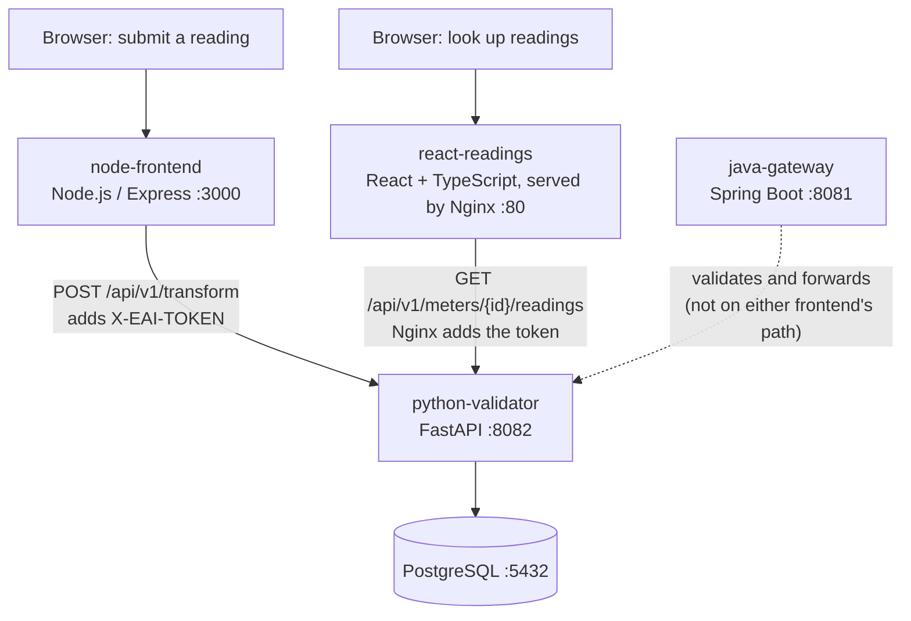
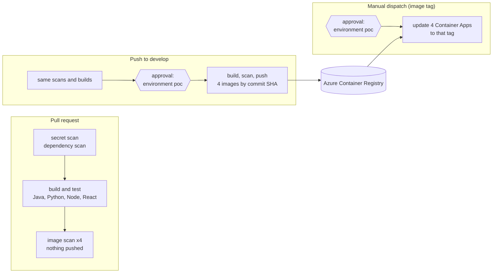

# Enterprise Integration Pipeline — Spring Boot, FastAPI, Node, React, PostgreSQL, Docker, GitHub Actions, Terraform, Azure Container Apps

> **Status: work in progress.** This repository is a hands-on proof of concept (POC) built while the author brings a long enterprise-integration background up to date with current cloud-native practice. The application layer and the Azure delivery pipeline work end to end; testing depth, API security, the data layer and Kubernetes are planned next (see [Status and roadmap](#status-and-roadmap)). Limitations are stated openly in [Known limitations](#known-limitations).

The project implements a small smart-meter ingestion flow. A browser form (Node.js) or a Java Spring Boot gateway receives meter readings, a Python FastAPI service validates and stores them in PostgreSQL, and a React and TypeScript screen reads them back. It is deployed to Microsoft Azure Container Apps through a GitHub Actions pipeline that authenticates with workload identity federation, scans every change, and deploys by immutable image tag after a manual approval.

## What this project demonstrates

- A polyglot service set (Java 21, Python 3.14, Node 22, React and TypeScript) containerised with Docker and run locally with Docker Compose.
- A CI/CD pipeline with secret scanning, dependency scanning, image scanning, build and test, and a gated build-once, deploy-by-tag release flow.
- **Security remediation, not just scanning:** the vulnerabilities and secrets that the scanners reported were triaged and fixed, and the gates were then proved to block (see [Vulnerability and secret remediation](#vulnerability-and-secret-remediation)).
- Infrastructure as code with Terraform on Azure, including identity bootstrap, a shared registry and a Container Apps stack, with remote state in HCP Terraform.
- Security practice: no stored cloud credentials, managed identities, Key Vault secret references, internal-only backends, and scan gates that fail on actionable findings.

## What this project does

The runtime has two independent paths that share one backend and one database.



| Service | Folder | Role |
|---|---|---|
| `java-gateway` | `01-java-ingestion-service` | Spring Boot ingestion gateway: Bean Validation, forwards to the Python service, and a health check that probes the downstream service. Kept deployed and internal-only; reserved for the planned testing and API-security work. |
| `python-validator` | `02-python-transformation-api` | FastAPI service that authenticates requests, validates and stores readings, and serves the read endpoint. The only service that talks to the database. |
| `node-frontend` | `03-node-frontend` | Node.js / Express web form (the write path). Attaches the shared token and calls the Python service directly. |
| `react-readings` | `04-react-readings` | React and TypeScript read-only screen (the read path), served by Nginx, which also reverse-proxies `/api/*` to the Python service and injects the token so that no secret reaches the browser. |
| PostgreSQL | image `postgres:16-alpine` | A local container for development; a Container App in Azure (see [Known limitations](#known-limitations)). |

## Why Container Apps and one environment: how this repository relates to the three-environment repository

This is the **second** of two related repositories, and the two are meant to be read together.

| | Three-environment repository | This repository |
|---|---|---|
| Link | [`enterprise-integration-azure`](https://github.com/nikmar0808/enterprise-integration-azure) | `eai-azure-poc` (this one) |
| Compute | One virtual machine per environment running Docker Compose | Azure Container Apps |
| Environments | Development, UAT and Production, structurally identical, isolated by resource group and role scope | One gated environment, `poc` |
| What it demonstrates | **Multi-environment CI and release management:** build once on `develop`, then promote the *same* immutable image tag to UAT and Production by manual dispatch; a separate deployment identity per environment; an approval gate on Production; rollback by redeploying a previous tag; Terraform per environment | **Modern delivery and hardening:** a managed container platform, a React and TypeScript frontend, a Node frontend, gated build-and-deploy, scan gates and their remediation, scoped identities |
| Application code | Same four-service flow, shared | Same, with two frontends added |

The two repositories deliberately differ. The first one answers "how are code and releases promoted across environments?"; this one answers "how does the same system run on a current managed platform, and how is it hardened?"

**Why this one has a single environment on Container Apps.** The three-environment design needs three virtual machines and three public IP addresses at once. The free-tier Azure subscription used here allows four vCPUs in one region (two per VM, so six were needed) and three public IPs, and managed Kubernetes was ruled out by a feasibility check on the same quota and on virtual-machine size availability. Azure Container Apps on the Consumption plan needs none of those resources and teaches a different platform and a different identity model, so it was chosen instead, with a single environment behind an approval gate. The virtual-machine, three-environment design is retained in `infra/dev`, `infra/uat` and `infra/prod` as a reference and is not deployed from this repository. [`docs/ARCHITECTURE_AZURE.md`](docs/ARCHITECTURE_AZURE.md) and [ADR-009](docs/adr/ADR-009-ci-deploys-to-container-apps-via-poc-environment.md) record each constraint and the trade-off it forced. A real organisation would run one environment per stage on either platform.

## Local quickstart

Requires Docker and Docker Compose. No Azure account is needed: this path verifies the application layer on its own.

```powershell
# PowerShell, from the repository root
Copy-Item .env.sample .env
# edit .env: set POSTGRES_PASSWORD and API_SECURITY_TOKEN to long random values

docker compose -f docker-compose.dev.yml up --build -d
docker compose -f docker-compose.dev.yml ps
```

```bash
# bash equivalent
cp .env.sample .env      # then edit the two values
docker compose -f docker-compose.dev.yml up --build -d
docker compose -f docker-compose.dev.yml ps
```

| What | Where |
|---|---|
| Submit a reading (Node form) | http://localhost:3000 |
| Look up readings (React screen) | http://localhost:8080 |
| Java gateway health | http://localhost:8081/health |
| Python service health | http://localhost:8082/health |

Calling the gateway directly (the frontends bypass it):

```bash
curl -X POST http://localhost:8081/api/v1/ingest/bulk \
  -H "Content-Type: application/json" \
  -d '{"meter_id":"MTR-000123","grid_zone":"ZONE-A","readings":[{"timestamp":"2026-01-01T00:00:00Z","kwh_value":12.5}]}'
```

```powershell
# PowerShell equivalent
Invoke-RestMethod -Uri http://localhost:8081/api/v1/ingest/bulk -Method Post -ContentType "application/json" `
  -Body '{"meter_id":"MTR-000123","grid_zone":"ZONE-A","readings":[{"timestamp":"2026-01-01T00:00:00Z","kwh_value":12.5}]}'
```

`.env` is ignored by Git. `docker-compose.dev.yml` builds the images from source and includes a containerised PostgreSQL; it is distinct from the deployed Azure environment described below.

## Delivery pipeline

One workflow, [`.github/workflows/ci.yml`](.github/workflows/ci.yml), behaves differently for three situations. The decision is recorded in [ADR-009](docs/adr/ADR-009-ci-deploys-to-container-apps-via-poc-environment.md).



- **Build once, deploy by tag.** Images are built only by CI, tagged with the commit SHA, and never rebuilt. Deploying points the running apps at an existing tag; it never builds and never handles a secret.
- **Two approvals.** A GitHub Environment named `poc` holds a required-reviewer rule. It pauses publishing images and, separately, deploying them.
- **Terraform and the pipeline have separate jobs.** Terraform owns the platform; the pipeline owns the running image tag, and Terraform is told to ignore that one field.

## Vulnerability and secret remediation

Scanning alone only produces a list. In this repository the scanners' findings were also worked through, and the scan gates were then tightened and proved.

**Vulnerabilities (Trivy).**

- **Triage.** All four images and the dependency files were scanned. Each finding was classified by layer (operating-system package or application library) and by whether a fixed version exists, which separates what can be acted on from what cannot.
- **Fixes.** Findings with a fix were removed by refreshing base images and upgrading dependencies in the Maven, Python and npm manifests and the Dockerfiles. The before and after counts were recorded.
- **Policy.** The build fails on CRITICAL and HIGH findings that have a fix available. Findings with no fix are ignored as not actionable. A fixable finding that is consciously accepted is recorded in [`.trivyignore`](.trivyignore) with a reason and an expiry date, so the exception lapses and the build fails again.
- **Proof.** A pull request with a deliberately outdated base image was shown to fail the image scan, then reverted. The failed and passing runs remain in the Actions history.

**Secrets (TruffleHog and Gitleaks).**

- **A scanner gap found and closed.** TruffleHog in verified-only mode can only report credentials it can prove are live, so a home-made token or password can never be flagged. The secret scan now also runs Gitleaks over the full Git history with a project-specific rule for the retired values; the rule's pattern is held in a repository secret, not in the repository. TruffleHog now also reports findings it cannot verify. GitHub secret scanning and push protection are enabled.
- **Baseline and remediation.** A scan of the full history found one retired project value quoted in a documentation file. The file was corrected, the one historical finding was accepted narrowly by its exact commit, file and line, and rotation of the underlying token was scheduled before the second cloud implementation is rebuilt. The reasoning follows the usual order: revoke or rotate, then remove, and only then consider rewriting history.
- **Proof.** A pull request containing a deliberately fake credential was shown to fail the secret scan with the value redacted in the log, then reverted.
- **Accepted findings** (for example a disposable test-database password used only by the CI job) are recorded with reasons in [`docs/scrub-allowlist.md`](docs/scrub-allowlist.md).

## Azure deployment

A single environment, deployed on an Azure free-tier subscription, is provisioned from Terraform and updated by the pipeline above. It is **temporary by design**: the free credit expires, so the environment is destroyed on a planned date and can be rebuilt from this repository (see [`docs/DEPLOYMENT_AZURE.md`](docs/DEPLOYMENT_AZURE.md)).

| Azure service | Purpose |
|---|---|
| Azure Container Apps (5 apps) | Runtime for `java-gateway`, `python-validator`, `node-frontend`, `react-readings` and PostgreSQL, on the Consumption workload profile |
| Azure Container Registry | One shared registry holding the four application images |
| Azure Key Vault | Runtime secrets, referenced by the apps through their managed identity |
| User-assigned managed identity | Image pull and Key Vault access for the Container Apps |
| Microsoft Entra ID | Workload identity federation for GitHub Actions (no stored credentials) |
| Azure Monitor and Log Analytics | Log collection, a dashboard, and alert rules (restart count, error rate) |
| HCP Terraform | Terraform state storage (local execution mode) |

After a deployment, the two public addresses come from the Terraform outputs; both are restricted to an allow-listed operator address:

```powershell
cd infra/aca
terraform output -raw node_frontend_fqdn
terraform output -raw react_readings_fqdn
```

## Identity and security model

- **No stored cloud credentials.** GitHub Actions authenticates to Azure with OIDC workload identity federation: Azure trusts a short-lived signed token that names the repository and the `poc` environment, so no client secret is stored in GitHub.
- **Least privilege by scope.** The pipeline identity holds roles scoped to the one resource group and the one registry it needs. Each Container App pulls images and reads secrets through its own managed identity.
- **Secrets stay in Key Vault.** Apps read secrets through Key Vault references; the deploy step changes only the image tag, and the Terraform-generated secrets never pass through the pipeline.
- **Internal-only backends.** The Python service, the Java gateway and the database are not reachable from the internet. The two public endpoints are IP allow-listed.
- **Public repository hygiene.** The repository was scrubbed before publication, and secret scanning runs on every change.

## Infrastructure as code

Terraform roots in use, each with its own state:

| Folder | Creates |
|---|---|
| `infra/bootstrap` | Entra applications and federated credentials for GitHub Actions (applied once, locally) |
| `infra/shared` | The shared resource group and Azure Container Registry |
| `infra/aca` | The Container Apps stack: managed identity, Log Analytics, Container Apps environment, Key Vault and secrets, five apps, role assignments |

State is stored in HCP Terraform under local execution mode, so every `terraform apply` runs from the operator's machine with an interactive Azure CLI session. See [`docs/INFRA_VIEW_AZURE.md`](docs/INFRA_VIEW_AZURE.md) for a resource-by-resource map.

## Known limitations

These are deliberate, documented trade-offs of a free-tier POC, not hidden gaps.

| Limitation | Why, and the production alternative |
|---|---|
| PostgreSQL runs as a container with **ephemeral storage** | Azure Files over SMB cannot support the permission changes PostgreSQL's initialisation makes, and the supported alternatives cost more than the POC window justifies. Production uses a managed server (Azure Database for PostgreSQL) behind private networking. |
| The public endpoints have **no application-level authentication**; they are IP allow-listed | A stand-in for a gateway with token validation. Production puts an API gateway or WAF in front, with OAuth2/JWT on the route. |
| Azure Front Door could not be created | Azure forbids it on free-trial subscriptions; recorded in [ADR-008](docs/adr/ADR-008-react-frontend-and-edge-cdn.md). Production would put an edge or CDN layer in front of the React screen. |
| The Java service has **no unit tests**; the Node service has no tests | The Java build passes trivially because `src/test` is empty. Testing is the next planned stage. |
| One environment, one reviewer | Approval is an audit record, not a second pair of eyes. A team uses one environment per stage and a different reviewer. The [three-environment repository](https://github.com/<GITHUB_ORG>/<THREE_ENV_REPO_NAME>) shows the multi-stage arrangement. |

## Status and roadmap

**Done.** Local and Azure deployment of all services; the CI/CD pipeline described above; scan and secret remediation with proved gates; hardening of ingress, secrets handling and identities; and architecture decisions (ADR-001, 002, 003, 008 and 009).

**Next, in order.**

1. Backend modernisation and tests: contract-first OpenAPI, JUnit and Mockito, pytest with a rolling-back database fixture, cross-service integration tests, OAuth2/JWT resource-server security.
2. Data layer: PostgreSQL performance work, migrations with Alembic, idempotent ingestion, a MongoDB audit store.
3. Frontend depth: TypeScript, Jest and React Testing Library.
4. Containers and Kubernetes on a local cluster, Helm, delivery patterns.
5. Observability and operations; cloud, IaC and security patterns on a second cloud.

**Azure-only extensions under consideration** (these need a live subscription): an API gateway with token validation, a private-network managed PostgreSQL, Application Insights tracing, and canary traffic splitting.

## Documentation

- [`docs/ARCHITECTURE_AZURE.md`](docs/ARCHITECTURE_AZURE.md) — design principles, key decisions, constraints, and the identity and security model
- [`docs/INFRA_VIEW_AZURE.md`](docs/INFRA_VIEW_AZURE.md) — infrastructure inventory, identity relationships and the Terraform map
- [`docs/DEPLOYMENT_AZURE.md`](docs/DEPLOYMENT_AZURE.md) — instructions to deploy to an independent Azure subscription
- Architecture decision records: [ADR-001](docs/adr/ADR-001-fresh-history-copies.md), [ADR-002](docs/adr/ADR-002-branching-model.md), [ADR-003](docs/adr/ADR-003-repository-visibility.md), [ADR-008](docs/adr/ADR-008-react-frontend-and-edge-cdn.md), [ADR-009](docs/adr/ADR-009-ci-deploys-to-container-apps-via-poc-environment.md)
- [`docs/scrub-allowlist.md`](docs/scrub-allowlist.md) — accepted scan findings and the reasons
