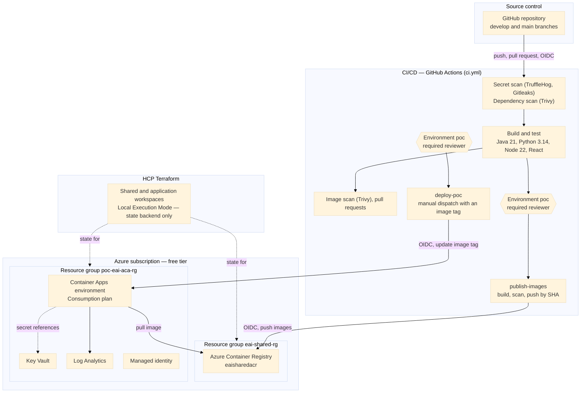
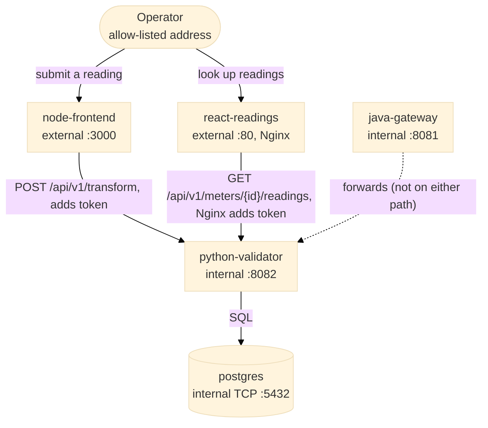
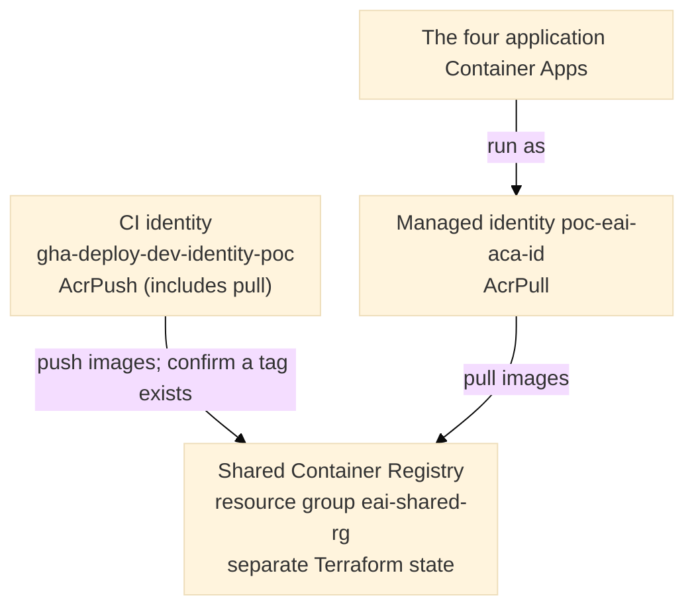

# Architecture and Design Rationale — Azure Implementation

This document explains why the Azure implementation in this repository is built the way it is. It does not contain execution instructions: for those, see [`DEPLOYMENT_AZURE.md`](DEPLOYMENT_AZURE.md). A resource-by-resource map is in [`INFRA_VIEW_AZURE.md`](INFRA_VIEW_AZURE.md). No Azure subscription access or command execution is required to read this document.

This implementation runs the Enterprise Integration application on **Azure Container Apps, in a single environment behind an approval gate**. It is the second of two related repositories. The first, [`enterprise-integration-azure`](https://github.com/nikmar0808/enterprise-integration-azure), implements a three-environment (Development, UAT, Production) virtual-machine pipeline and demonstrates multi-environment promotion and release management. This repository shows the same application on a managed container platform, with a hardened delivery pipeline. Where a decision exists specifically because of Azure free-tier constraints on the executing subscription, this document states the constraint explicitly and names the alternative a paid subscription would normally adopt, rather than presenting the constrained choice as the only valid one.

---

## 1. Design Principles

1. **CI/CD performs all deployment, and a human approves each consequential step.** A push to `develop` builds, scans and tests everything, then pauses for approval before images are published. Deployment is a separate, manually started run that also pauses for approval. Neither step happens automatically.
2. **Build once, deploy by immutable tag.** Images are built only by CI from a clean checkout, tagged with the commit SHA, and never rebuilt. Deploying points the running apps at an existing tag. A tag is never reused, so a deployment is always traceable to one commit.
3. **No long-lived Azure credentials are used by any automated identity.** GitHub Actions authenticates to Azure exclusively through OpenID Connect and a Microsoft Entra federated identity credential. No client secret is stored in GitHub.
4. **All Terraform workspaces use Local Execution Mode.** Every `terraform apply` runs from the operator's own machine, authenticated by an interactive `az login` session. HCP Terraform is used solely as the remote state backend, so no cloud credential is held by HCP Terraform either.
5. **Identity follows the number of environments.** This implementation has one environment and therefore one deployment identity. That is a deliberate departure from the per-environment isolation principle, under which each environment has its own principal because Azure role assignments attach to the principal, not to the credential that obtained a token. A multi-environment pipeline must restore one principal per environment; the three-environment repository does exactly that.
6. **Secrets never travel through the pipeline.** Application secrets live in Azure Key Vault and are resolved by the platform through each app's managed identity. The deployment step changes only an image tag. No secret value appears in a workflow, a command line, or a Container App definition.
7. **Internal services are not exposed.** The Python service, the Java gateway and the database accept traffic only from inside the Container Apps environment. The two frontends are the only external endpoints, and each is restricted to an allow-listed address.
8. **Scan gates fail on actionable findings, and exceptions expire.** Findings that have a fix block the build; findings with no fix are not actionable and are not counted. A fixable finding that is consciously accepted is recorded with a reason and an expiry date, so the exception lapses and the build goes red again.
9. **Free-tier constraints are stated, not hidden.** The subscription has a four-vCPU regional quota, a three-public-IP ceiling, restricted virtual-machine families, and a restriction on some products. Each constraint that shaped a decision is flagged at the point of definition, with the unconstrained alternative named alongside it.
10. **Every specification is grounded in the resource names actually used.** Account-specific identifiers (tenant, subscription, repository and application IDs) appear only as placeholders, so that the documents are safe to publish and reusable. Section 9 lists the identifiers.

---

## 2. Key Architecture Decisions

| Decision | Rationale |
|---|---|
| The runtime is **Azure Container Apps** on the Consumption plan, not virtual machines or Kubernetes. | The three-environment virtual-machine design needs three VMs of two vCPUs each against a four-vCPU quota, and three public IP addresses against a ceiling of three. Managed Kubernetes was ruled out by a feasibility check (Section 4). Container Apps needs neither a VM size nor a public IP, bills per second of actual use, scales to zero, and offers a different platform and identity model to learn. |
| There is **one environment**, named `poc`, behind a GitHub Environment with a required reviewer. | One environment fits the subscription's quota and keeps the pipeline small enough to reason about. The approval gate and a branch restriction on the environment give the controls that matter most. The multi-stage arrangement is demonstrated by the three-environment repository. |
| A **single shared Container Registry** holds all four images. | The registry is the one resource with its own resource group and its own Terraform state. It outlives the application stack, so tearing the stack down never deletes images, and a rebuild does not have to re-create them. |
| **Terraform owns the platform; the pipeline owns the running image tag.** Each application resource ignores changes to its image. | Without this, the next `terraform apply` would roll an app back to the tag written in the Terraform file. The split is the standard way to let infrastructure as code and continuous delivery coexist when Terraform runs locally. |
| Application secrets are **Key Vault secret references** resolved by the platform. | A deployment that only changes an image tag needs no secret access, which removes a class of leak (a secret written into a command line or a log). |
| The pipeline identity holds **`Contributor` on one resource group** and **`AcrPush` on the registry**. | Azure has no built-in role limited to updating Container Apps. Scoping `Contributor` to the single resource group, never the subscription, is the narrowest built-in arrangement; a custom role limited to that action is the tighter alternative. |
| **PostgreSQL runs as a container with ephemeral storage.** | A managed Flexible Server needs private networking, and the persistent-storage options for a container database either do not support PostgreSQL's file-permission changes (Azure Files over SMB) or cost more than a short-lived environment justifies. Section 8 describes the production alternative. |
| The React frontend is served by **Nginx, which proxies `/api/*` and injects the token**. | The browser never holds a secret: Nginx is the trust boundary, as the Node frontend is for the write path. Nginx is a purpose-built static server and reverse proxy, and it uses the same environment-variable substitution mechanism for the token as for the upstream address. |
| The two public endpoints are protected by an **ingress address allow-list**, not by application authentication. | A stand-in for a gateway with token validation. Because the Nginx proxy adds the shared token to every request, the allow-list is the only barrier on the read path; a production system puts a gateway or web application firewall in front, with OAuth2 or JWT validation on the route. |
| **Secret scanning combines TruffleHog and Gitleaks**, plus GitHub push protection. | A scanner that reports only credentials it can verify as live cannot flag home-made tokens or passwords, because there is no issuer to check them against. Gitleaks, with a project-specific rule held in a repository secret, covers those. |

---

## 3. Target Architecture

### Application components inside the environment

The write path (Node to Python to PostgreSQL) and the read path (React and Nginx to Python to PostgreSQL) are independent and share only the Python service and the database. The Java gateway is deployed and healthy but is called by neither path; it is retained for planned testing and API-security work. Python's response is returned unmodified: the services in front of it authenticate and route, and do not reshape responses.

---

## 4. Free-Tier Constraints and What They Forced

### 4.1 Compute quota and virtual-machine availability

The subscription's `Standard Bsv2 Family vCPUs` quota in the deployment region is **4**, and the cap across all virtual-machine families combined is also **4**. Each virtual machine in the three-environment design (`Standard_B2s_v2`) consumes 2 vCPUs, so three persistent environments need 6. A formal quota increase is not assumed available on a free-tier subscription. In addition, every general-purpose `Standard_D*`, `Standard_E*` and `Standard_F*` size, and every classic burstable (v1) size, is unavailable to this subscription in the region, independently of quota.

The three-environment repository works within this limit by provisioning Production once and cycling Development and UAT, only one of which fits beside it. That model is documented there. In this repository the constraint disappears by construction, because Container Apps on the Consumption plan consumes none of these quotas.

### 4.2 Managed Kubernetes was ruled out

Azure Kubernetes Service was evaluated and rejected, for two independent reasons, either of which was sufficient:

- **Quota.** The recommended topology (a system node pool of at least two nodes plus a user pool) needs at least eight vCPUs. The regional cap is four.
- **Node size.** Microsoft recommends a non-burstable general-purpose size for the system pool, so that CPU-credit throttling cannot starve cluster components. Those families are unavailable to this subscription. A single burstable node would fit the arithmetic but would teach an anti-pattern.

Kubernetes, Helm and `kubectl` are therefore exercised on a local cluster instead. A paid subscription with standard quota would run AKS with a system pool and a user pool, and use workload identity for secret access.

### 4.3 Region relocation was evaluated and rejected

Because quota is scoped per region, relocating one environment to another region was evaluated. Every alternative region was disqualified for an independent reason: PostgreSQL Flexible Server restricted for the subscription in some, the region unsupported by the relevant usage interfaces in others, or the entire burstable virtual-machine family blocked. The conclusion is that this subscription's access to that family is effectively limited to a single region.

### 4.4 Public IP ceiling

The subscription allows three Standard public IPs. The virtual-machine design consumes all three on the machines themselves (each is the backend address for its environment's API gateway), which left no quota for a dedicated bastion host per environment. Container Apps has no public IP resource to provision, so this constraint does not apply here. Section 6 describes how operator access works instead.

### 4.5 Azure Front Door and CDN

An edge layer in front of the React frontend was attempted with Azure Front Door Standard and refused by the platform: Azure forbids Front Door resources on free-trial and student accounts, a restriction tied to the subscription type rather than to quota, region or SKU. Classic Azure CDN cannot be used as a fallback, because Microsoft stopped allowing new classic profiles in 2025. No CDN or edge product is currently available to this subscription, so the frontend is reached directly at its Container Apps address, with no edge caching, no global points of presence and no web application firewall. [ADR-008](adr/ADR-008-react-frontend-and-edge-cdn.md) records the original reasoning and the amendment. A paid subscription removes the restriction.

### 4.6 The environment is temporary

The subscription runs on a time-limited credit. The environment is therefore treated as disposable: everything it contains is defined in Terraform and the pipeline, and it can be destroyed and rebuilt from the repository. Loss of the subscription costs nothing but time.

---

## 5. Shared Container Registry Model

Every other Azure resource in this implementation is part of one application stack. The Container Registry is the deliberate exception: it has its own resource group, its own Terraform workspace, and its own lifecycle. It is provisioned once and is not destroyed as part of the application stack's lifecycle.

The registry holds four repositories, one per application image. The images are built by CI and tagged with the commit SHA.

The CI identity holds `AcrPush`, a built-in role that also includes pull rights, so no separate pull assignment is needed. The apps' managed identity holds `AcrPull` alone and cannot push. *Analogy:* a loading pass also permits collecting cargo, whereas a receiving pass does not permit loading.

Role assignments work across resource-group boundaries by scope, so the registry does not need to live inside the application's resource group. The application stack finds it through a read-only lookup, not a resource reference, because it is managed in a different state.

**Retention.** No retention policy is defined on the registry in this implementation. A steady-state deployment should add one, so that old SHA-tagged images are cleaned up without breaking rollback to a recent known-good tag.

---

## 6. Operator Access

There are no virtual machines, no SSH keys and no bastion host in this implementation, so the interactive-access problem of the virtual-machine design does not arise. An operator authenticates through Microsoft Entra ID (`az login`, with multi-factor authentication) and reaches running apps through the Azure control plane:

- **Logs and system events** with `az containerapp logs show`, which reads the same streams that Log Analytics collects.
- **Revisions and health** with `az containerapp revision list` and `az containerapp show`.
- **A shell inside a running container**, where needed, with `az containerapp exec`, authorised by role assignment on the resource group.
- **Secrets** are read through Key Vault role assignments, never through a distributed credential.

No credential is distributed for any of these. The virtual-machine design the first repository implements uses an Entra-authenticated SSH path with an operator-address firewall rule, because a dedicated bastion host did not fit the public-IP quota; that trade-off is documented there.

---

## 7. CI/CD Pipeline Design

A single workflow behaves differently for three situations.

| Trigger | Jobs | Outcome |
|---|---|---|
| Pull request | Secret scan, dependency scan, build and test for all four services, then an image build and scan per service | Nothing is pushed and nothing touches Azure. A fixable serious vulnerability, a leaked secret, or a failing build blocks the merge. |
| Push to `develop` | The same scans and builds, then `publish-images` | After approval, builds all four images, scans each, and pushes them tagged with the commit SHA. A tag that already exists in the registry is skipped, so a re-run is safe. |
| Manual dispatch with an image tag | `deploy-poc` only | After approval, confirms the four tags exist, updates the four application Container Apps to those tags, and waits until each new revision reports as provisioned. It never builds. |

**The approval gate.** Two jobs declare the GitHub Environment `poc`: the publishing job and the deployment job. GitHub holds each until the required reviewer approves. The environment also restricts which branch may use it, so a job on any other branch cannot obtain the environment's identity. Declaring the environment is also what gives the job the token subject (`environment:poc`) that the federated credential trusts, so the gate and the identity are enforced by the same name. With a single reviewer, approval is a deliberate pause and an audit record rather than independent review; a team uses a different person as reviewer.

**Why the image is scanned in the same job that pushes it.** A scan only means something about the exact artifact that ships. Scanning and pushing in one job, with the push last, guarantees that a failing scan prevents the push.

**Scan policy.**

- Findings of CRITICAL or HIGH severity that have a fixed version fail the build, for the dependency files and for every image.
- Findings with no fix are ignored as not actionable.
- Accepted fixable findings are recorded in an ignore file with a reason and an expiry date.
- The secret scan runs TruffleHog (verified and unknown findings) and Gitleaks over the full Git history, with a project-specific rule held in a repository secret and findings redacted in the public log. GitHub secret scanning and push protection add a check before a push reaches the repository.

**What the deployment verifies, and what it cannot.** The deployment job confirms that each new revision reaches the provisioned state. It cannot call the apps, because the two external ones are restricted to the operator's address and a GitHub runner is not on the allow-list. Functional verification is performed by the operator.

---

## 8. Data Tier and Network Exposure

### 8.1 PostgreSQL as a container

PostgreSQL runs as a Container App with internal TCP ingress, one fixed replica, and no persistent volume. Two consequences follow:

- **The data is ephemeral.** A restart, scale event or replacement starts an empty database. The Python service creates its tables when it starts, which is what makes an ephemeral database usable between restarts and what a migration tool should later replace.
- **It is not a production pattern.** A real deployment uses a managed database service, such as Azure Database for PostgreSQL Flexible Server, with backups and point-in-time restore. Reaching a private managed server from Container Apps needs an environment integrated with a virtual network, with a delegated database subnet and a private DNS zone. Workload-profile environments support this, and the Consumption profile in such an environment has no fixed cost for the environment itself, so this is the natural next step on a subscription that allows it.

### 8.2 Exposure and authentication

| App | Reachable from | Authentication |
|---|---|---|
| `node-frontend` | One allow-listed operator address | None at the application; address allow-list only |
| `react-readings` | One allow-listed operator address | None at the application; address allow-list only. Nginx adds the shared token to proxied calls. |
| `python-validator` | Inside the environment only | Shared token header, validated before the payload |
| `java-gateway` | Inside the environment only | Not called by the frontends |
| `postgres` | Inside the environment only | Password, from Key Vault |

The shared token is a single value known to every service that calls the Python service, so it identifies the caller's tier, not an individual. Replacing it with signed, scoped tokens (OAuth2 or JWT) validated at a gateway is the planned production-shaped change.

---

## 9. Identifier Inventory

The table below is the single point of reference for the identifiers used across this document set. Account-specific identifiers are given only as placeholders; the placeholder names match those defined in `DEPLOYMENT_AZURE.md`. Resource names in the third column are example values from the reference deployment, shown for orientation only. Globally unique names (registry, Key Vault) are placeholders in `DEPLOYMENT_AZURE.md` and must be chosen per deployment.

| Identifier | Placeholder | Reference-deployment example |
|---|---|---|
| Azure Tenant ID | `<AZURE_TENANT_ID>` | not published |
| Azure Subscription ID | `<AZURE_SUBSCRIPTION_ID>` | not published |
| Azure Subscription type | — | free-tier subscription |
| Azure region | `<AZURE_LOCATION>` | `centralindia` |
| GitHub repository | `<GITHUB_ORG>/<REPO_NAME>` | this repository |
| GitHub owner ID and repository ID | `<GITHUB_OWNER_ID>` and `<GITHUB_REPO_ID>` | not published |
| HCP Terraform organization | `<HCP_TERRAFORM_ORG>` | not published |
| HCP Terraform workspaces | `<HCP_TERRAFORM_WORKSPACE_SHARED>`, `<HCP_TERRAFORM_WORKSPACE_ACA>` | `poc-eai-shared-azure`, `poc-eai-aks-azure` (the second name is inherited from an earlier plan and unrelated to what the workspace deploys) |
| Resource groups | literal naming convention | `poc-eai-aca-rg`, `eai-shared-rg` |
| Container Registry | `<AZURE_ACR_NAME>` | `eaisharedacr` |
| Key Vault | `<AZURE_KEY_VAULT_NAME>` | `poc-eai-kv-<suffix>` |
| Managed identity | literal naming convention | `poc-eai-aca-id` |
| Log Analytics workspace | literal naming convention | `poc-eai-law` |
| Container Apps environment | literal naming convention | `poc-eai-aca-env` |
| Container Apps | literal naming convention | `poc-eai-python-validator`, `poc-eai-java-gateway`, `poc-eai-node-frontend`, `poc-eai-react-readings`, `poc-eai-postgres` |
| CI identity | client ID `<AZURE_CLIENT_ID>` (bootstrap output `gha_deploy_dev_client_id`) | `gha-deploy-dev-identity-poc` |
| GitHub Environment | literal | `poc` |
| GitHub repository variables | `AZURE_TENANT_ID`, `AZURE_SUBSCRIPTION_ID`, `ACR_NAME`, `AZURE_CLIENT_ID` | — |
| GitHub repository secret | `GITLEAKS_PROJECT_REGEX` | — |

---

## Appendix A — Identity, Federation and RBAC Reference

### A.1 The federated credential

Microsoft Entra federated identity credentials match exactly one subject each. The CI identity holds one credential:

| Credential | Subject shape | Used by |
|---|---|---|
| `github-actions-poc-environment` | `repo:<owner>@<owner-id>/<repo>@<repo-id>:environment:poc` | The publishing and deployment jobs, both of which declare `environment: poc` |

The subject must match the GitHub token's claim character for character. The environment name appears in three places that must agree: the credential's subject, the GitHub Environment, and the workflow's `environment:` line. A mismatch is refused at login. A credential carries no permissions: what the identity may do is decided entirely by role assignments on its service principal.

### A.2 Identity inventory

| Identity | Type | Credential mechanism | Consumer |
|---|---|---|---|
| Operator's own Azure session | Human, interactive | `az login`, multi-factor | Every local `terraform apply`; ad hoc diagnostics |
| `gha-deploy-dev-identity-poc` | Entra application and service principal | GitHub Actions OIDC | The publishing and deployment jobs |
| `poc-eai-aca-id` | User-assigned managed identity | Platform-managed, no authentication step | All five Container Apps, for registry pulls and Key Vault secret references |

The bootstrap configuration also retains Entra applications for other environments and for HCP Terraform remote runs. They are inherited from the reference design, hold no role, and are not used by this implementation.

### A.3 RBAC grants by identity

| Identity | Grant | Scope |
|---|---|---|
| CI identity | `AcrPush` | The shared registry (includes pull; no separate `AcrPull`) |
| CI identity | `Contributor` | The resource group `poc-eai-aca-rg` only |
| Managed identity | `AcrPull` | The shared registry |
| Managed identity | `Key Vault Secrets User` | The Key Vault |
| Operator | `Key Vault Secrets Officer` | The Key Vault (to create the secrets) |

`Contributor` is broader than the single action required (updating Container Apps), because Azure has no built-in role scoped to exactly that action. A custom role restricted to it is the tighter alternative where the setup cost is justified; this implementation uses the built-in role, scoped to one resource group.

### A.4 Request flow traces

**1. Infrastructure change.** The operator authenticates with `az login`; the `azurerm` provider uses that session automatically, since no `ARM_*` variables or provider arguments are present. `terraform apply` runs locally; HCP Terraform receives and stores the resulting state only.

**2. Publishing images.** A push to `develop` passes the scans and builds, and the publishing job pauses at the `poc` environment. After approval it requests an OIDC token from GitHub; `azure/login` presents it against the federated credential; Entra issues a short-lived access token scoped by the identity's role assignments; the job builds and scans the four images and pushes them to the registry tagged with the commit SHA.

**3. Deploying.** The operator starts the workflow with an explicit image tag; the deployment job pauses at the `poc` environment and, after approval, authenticates the same way. It confirms the four tags exist, then updates each application Container App to its tag. Container Apps creates a new revision and pulls the image using the app's managed identity.

**4. Secrets at runtime.** When a revision starts, the platform resolves each Key Vault secret reference using the managed identity's `Key Vault Secrets User` grant and supplies the value to the container as an environment variable. The value never passes through the pipeline.

### A.5 Summary

Every non-human identity in this system is an Entra application or a managed identity, reached exclusively through OIDC federation or Azure's platform-managed identity mechanism, never a stored client secret. Role assignments are scoped to the one resource group and the one registry wherever Azure's role catalog permits, with one broader grant (`Contributor`) accepted as a built-in-role trade-off. No long-lived Azure credential exists in this system at any point.
