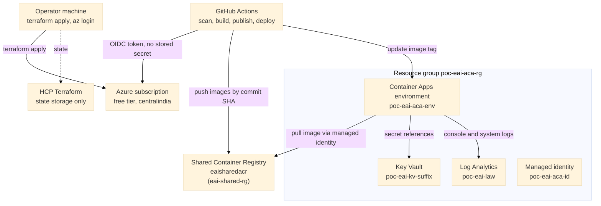
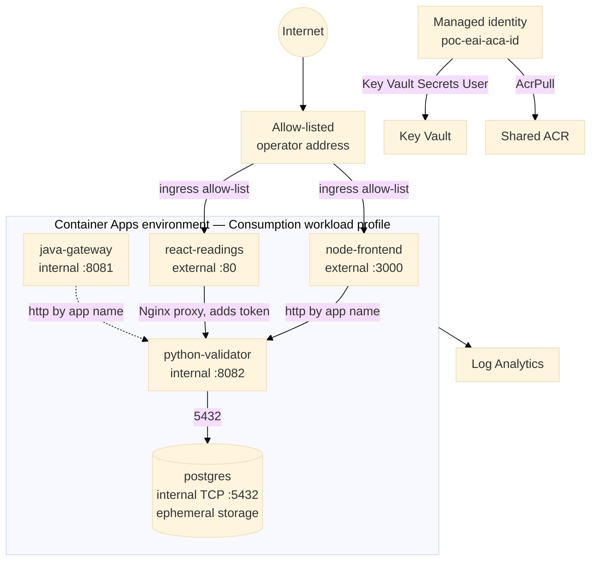
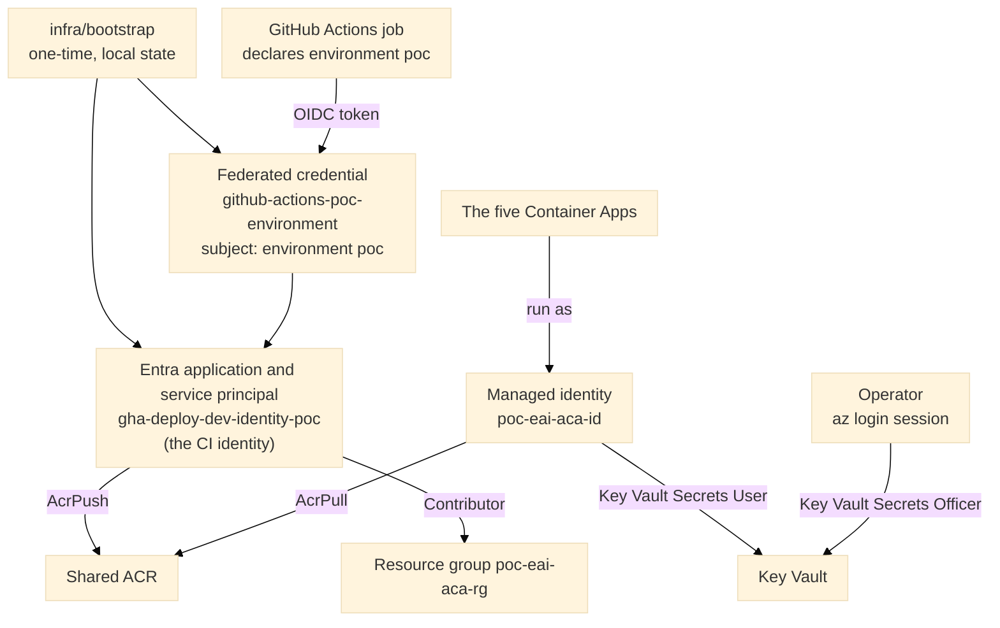
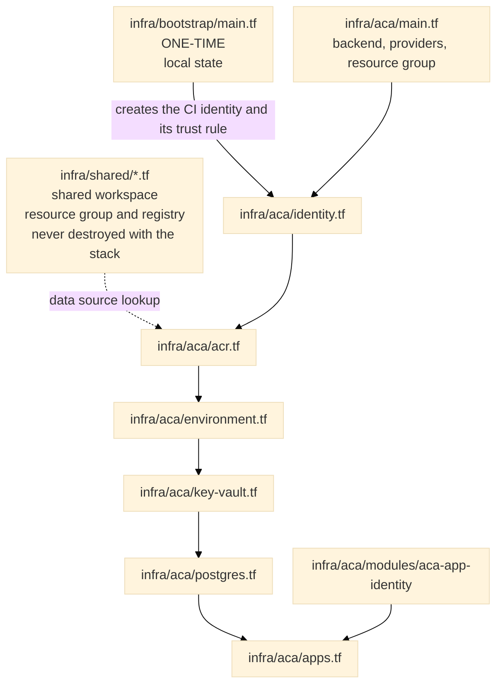

# INFRA_VIEW — Understand the Infrastructure (Azure Implementation)

This view is split into four layers. They are meant to be read in order: **Big Picture → Azure Infrastructure → Identity and Deployment → Terraform Map**. A fifth part traces the end-to-end flows, and a sixth lists points that are easy to misunderstand.

Resource names, Terraform resource types, source files and relationships are those of the reference deployment. Account-specific identifiers (tenant, subscription, repository and application IDs) appear only as placeholders. The design rationale behind these choices is in [`ARCHITECTURE_AZURE.md`](ARCHITECTURE_AZURE.md); step-by-step instructions are in [`DEPLOYMENT_AZURE.md`](DEPLOYMENT_AZURE.md).

**Scope.** This document describes what the three Terraform roots in use actually create: `infra/bootstrap`, `infra/shared` and `infra/aca`. The folders `infra/dev`, `infra/uat` and `infra/prod` hold an earlier, virtual-machine-based three-environment design. They are kept in the repository as a reference and are not deployed from it, so they are not described here. [`ARCHITECTURE_AZURE.md`](ARCHITECTURE_AZURE.md) explains why this implementation uses Azure Container Apps and a single environment instead.

---

# 1. Big Picture — How Everything Works



### The story in plain English

1. **HCP Terraform** stores Terraform state. Every `plan` and `apply` runs from the operator's own machine, authenticated by an interactive `az login` session; HCP Terraform never runs Terraform itself (local execution mode).
2. **GitHub Actions** scans and tests every change. On a push to `develop`, and after a manual approval, it builds four images once and pushes them to the shared registry, each tagged with the commit SHA. Deployment is a separate, manually started and approved run that points the running apps at an existing tag.
3. **Azure Container Apps** runs five apps in one environment: the Java gateway, the Python service, the Node frontend, the React frontend, and PostgreSQL. The apps find each other by name through the environment's internal DNS.
4. **Each app pulls its image and reads its secrets through one shared user-assigned managed identity.** The pipeline never sees a secret value.
5. **Only one registry exists.** It lives in its own resource group and its own Terraform state, so tearing down the application stack never touches it.
6. **The environment is temporary.** It runs on a free-tier credit, so it is destroyed on a planned date and rebuilt from the repository when needed.

---

# 2. Azure Infrastructure — What Exists



## Important facts about this topology

- **There is no virtual network.** The environment uses the Consumption workload profile without custom VNet integration. Container Apps provides an HTTPS ingress and name-based DNS inside the environment instead of subnets, route tables and security groups.
- **Three of the five apps are not reachable from the internet.** `python-validator`, `java-gateway` and `postgres` have internal-only ingress. Only the two frontends are external, and both carry an ingress rule that allows a single operator address and denies everything else at the platform edge.
- **PostgreSQL is a container, not a managed server.** It runs `postgres:16-alpine` with ephemeral storage, a fixed single replica, and a TCP ingress. Its data is lost when the container restarts. This is a documented free-tier trade-off; a production system uses a managed database behind private networking.
- **Apps scale to zero when idle** (minimum replicas 0, maximum 1), except PostgreSQL, which is fixed at one replica.

## Container Apps inventory

| App (resource name) | Terraform resource | Ingress | Port | CPU / memory | Replicas | Notable settings |
|---|---|---|---|---|---|---|
| `poc-eai-python-validator` | `azurerm_container_app.python_validator` | Internal | 8082 | 0.5 / 1 Gi | 0–1 | `DATABASE_URL` and `API_SECURITY_TOKEN` from Key Vault secret references |
| `poc-eai-java-gateway` | `azurerm_container_app.java_gateway` | Internal | 8081 | 0.5 / 1 Gi | 0–1 | Python service address by app name; downstream token from Key Vault |
| `poc-eai-node-frontend` | `azurerm_container_app.node_frontend` | External, one allowed address | 3000 | 0.25 / 0.5 Gi | 0–1 | Python service address by app name; token from Key Vault |
| `poc-eai-react-readings` | `azurerm_container_app.react_readings` | External, one allowed address | 80 | 0.25 / 0.5 Gi | 0–1 | Nginx reverse proxy to the Python service; token from Key Vault |
| `poc-eai-postgres` | `azurerm_container_app.postgres` | Internal, TCP | 5432 | 0.5 / 1 Gi | 1–1 | Password from a Key Vault secret reference; no volume |

## Azure resource inventory

| Azure entity | Terraform resource | Name | Defined in |
|---|---|---|---|
| Resource group (application) | `azurerm_resource_group.poc_aca` | `poc-eai-aca-rg` | `infra/aca/main.tf` |
| User-assigned managed identity | `azurerm_user_assigned_identity.aca` | `poc-eai-aca-id` | `infra/aca/identity.tf` |
| Log Analytics workspace | `azurerm_log_analytics_workspace.poc` | `poc-eai-law` (pay-as-you-go SKU, 30-day retention, 1 GB per day ingestion cap) | `infra/aca/environment.tf` |
| Container Apps environment | `azurerm_container_app_environment.poc` | `poc-eai-aca-env` (Consumption workload profile) | `infra/aca/environment.tf` |
| Key Vault | `azurerm_key_vault.poc` | `poc-eai-kv-<suffix>` (role-based authorisation, soft-delete 7 days, purge protection off) | `infra/aca/key-vault.tf` |
| Key Vault secrets | `azurerm_key_vault_secret` ×3 | `database-password`, `api-security-token`, `database-url` | `infra/aca/key-vault.tf` |
| Generated passwords | `random_password` ×2 | database password, API token | `infra/aca/key-vault.tf` |
| Container Apps | `azurerm_container_app` ×5 | see the table above | `infra/aca/apps.tf`, `infra/aca/postgres.tf` |
| Container Registry (shared) | `azurerm_container_registry.eai_acr` | `eaisharedacr` (Basic SKU, admin account disabled) in `eai-shared-rg` | `infra/shared/acr.tf` |
| Resource group (shared) | `azurerm_resource_group.shared` | `eai-shared-rg` | `infra/shared/resource-group.tf` |
| Alert rules and action group | created with the Azure CLI | restart-count alerts, an error-rate alert, an e-mail action group | **not in Terraform** |
| Dashboard | created in the portal | `poc-eai-window` | **not in Terraform** |

---

# 3. Identity and Deployment — Who Can Do What



## The identities

| Identity | Type | How it authenticates | Used by |
|---|---|---|---|
| Operator | Human, interactive | `az login`, MFA | Every `terraform apply`; ad hoc diagnostics |
| `gha-deploy-dev-identity-poc` (the CI identity) | Entra application and service principal | GitHub Actions OIDC, one federated credential | The image-publishing and deployment jobs |
| `poc-eai-aca-id` | User-assigned managed identity | Platform-managed, no authentication step | All five Container Apps, for registry pulls and Key Vault secret references |

The bootstrap configuration also retains inactive Entra applications and credentials inherited from the reference design (separate identities for the other two environments, and per-workspace identities for HCP Terraform remote runs). None is granted any role and none is used by this implementation, because there is one environment and Terraform runs locally.

## Role assignments

| Principal | Role | Scope | Defined in |
|---|---|---|---|
| CI identity | `AcrPush` | The shared registry (includes pull and the read needed to confirm a tag exists) | `infra/aca/acr.tf` |
| CI identity | `Contributor` | The resource group `poc-eai-aca-rg` only | `infra/aca/identity.tf` |
| Managed identity `poc-eai-aca-id` | `AcrPull` | The shared registry | `infra/aca/acr.tf` |
| Managed identity `poc-eai-aca-id` | `Key Vault Secrets User` | The Key Vault | `infra/aca/key-vault.tf` |
| Operator | `Key Vault Secrets Officer` | The Key Vault (needed to create the secrets) | `infra/aca/key-vault.tf` |

`Contributor` on the resource group is broader than the single action CI needs (updating Container Apps), because Azure has no narrower built-in role for it. A custom role limited to that action is the tighter alternative. The scope is the one resource group, never the subscription.

## The crucial identity distinction

**Trust and permission are separate things.** A *federated credential* only answers "may a token with this exact subject log in as this identity?". It carries no permissions. What the identity may *do* is decided entirely by role assignments on its service principal, which every credential attached to the application shares.

The credential's *subject* is matched character for character against the claim in GitHub's token. A job that declares `environment: poc` presents:

```text
repo:<GITHUB_ORG>@<GITHUB_OWNER_ID>/<REPO_NAME>@<GITHUB_REPO_ID>:environment:poc
```

The numeric owner and repository IDs come from `https://api.github.com/repos/<GITHUB_ORG>/<REPO_NAME>` (`owner.id` and `id`). The environment name in the subject, in the GitHub Environment, and in the workflow's `environment:` line must all match exactly, which is why no job can obtain a token from a branch or an unreviewed environment.

## What the pipeline does with these identities

- **Publish.** After approval, the CI identity logs in, builds the four images and pushes them to the shared registry tagged with the commit SHA.
- **Deploy.** After a second approval, the CI identity confirms the four tags exist and then updates the four application Container Apps to those tags. It changes the image only. It reads and writes no secret and holds no Key Vault role.
- **Runtime.** The managed identity pulls the images and resolves each Key Vault secret reference at the platform level. No secret value appears in a workflow, a command line or the Container App definition.

---

# 4. Terraform Map — Where Is Everything Defined?



## File-by-file map

### `infra/bootstrap/main.tf` — one-time trust foundation (local state)

| Terraform entity | Type | What it creates | Purpose |
|---|---|---|---|
| `gha_deploy_dev` | `azuread_application` and `azuread_service_principal` | `gha-deploy-dev-identity-poc` | The CI identity |
| `gha_deploy_dev` (credential) | `azuread_application_federated_identity_credential` | `github-actions-poc-environment` | Trusts jobs that declare `environment: poc` |
| other applications and credentials | `azuread_application`, `azuread_service_principal`, credentials | Inherited identities for other environments and for HCP Terraform remote runs | Retained from the reference design; granted no roles; not used |

Outputs: the client ID of each application. The CI identity's client ID is the value of the GitHub repository variable `AZURE_CLIENT_ID`.

A change in this folder has no effect until `terraform apply` is run **inside** it, because it is a separate root with its own local state.

### `infra/shared/*.tf` — the one cross-stack resource

- `main.tf` — HCP Terraform backend (the shared workspace) and the `azurerm` provider (`~> 4.0`)
- `resource-group.tf` — `azurerm_resource_group.shared`, `eai-shared-rg`
- `acr.tf` — `azurerm_container_registry.eai_acr`: name from `var.acr_name`, Basic SKU, admin account disabled
- `variables.tf` — input variables (several declared but unused in this folder)
- Outputs: `acr_id`, `acr_login_server`
- It has its own workspace, deliberately not folded into the application stack's state, so destroying the stack never touches the registry. The application stack finds the registry through a `data` lookup, not a resource reference, because the registry lives in a different state.

### `infra/aca/main.tf` — backend, providers and resource group

- HCP Terraform backend block; the workspace name is inherited from an earlier plan and is unrelated to what the folder deploys.
- Providers pinned in `required_providers`: `azurerm` `~> 4.0`, `azuread` `~> 3.0`, `random` `~> 3.6`. `azurerm` authenticates through the active `az login` session.
- The resource group `poc-eai-aca-rg`.

### `infra/aca/variables.tf` and `terraform.tfvars`

- Inputs: `gha_deploy_client_id` (the CI identity's client ID, sensitive), `acr_name`, `acr_resource_group`, `key_vault_name` (globally unique) and `operator_ip_cidr` (the single allowed address, as a `/32`).
- Values come from a local `terraform.tfvars`, which `.gitignore` excludes from version control.

### `infra/aca/identity.tf`

- `azurerm_user_assigned_identity.aca` — `poc-eai-aca-id`
- `data.azuread_service_principal.gha_deploy` — the CI identity, looked up by client ID
- `azurerm_role_assignment.gha_aca_contributor` — `Contributor` on the resource group for the CI identity
- Outputs: the identity's client ID and principal ID

### `infra/aca/acr.tf`

- `data.azurerm_container_registry.shared` — the existing registry, looked up by name and resource group
- `azurerm_role_assignment.aca_pull` — `AcrPull` for the managed identity
- `azurerm_role_assignment.gha_acr_push` — `AcrPush` for the CI identity
- Output: the registry login server

### `infra/aca/environment.tf`

- `azurerm_log_analytics_workspace.poc` — pay-as-you-go SKU, 30-day retention, a 1 GB daily ingestion cap as a cost safety net
- `azurerm_container_app_environment.poc` — Consumption workload profile, declared explicitly because Azure adds it to every environment regardless

### `infra/aca/key-vault.tf`

- `azurerm_key_vault.poc` — role-based authorisation, not access policies; the tenant comes from the active session
- `azurerm_role_assignment.terraform_kv_officer` and `azurerm_role_assignment.aca_kv_user` — see the role table above
- `random_password.db_password` and `random_password.api_token`
- `azurerm_key_vault_secret` ×3 — the two generated values, and `database-url`, a connection string whose host is the PostgreSQL app's name

### `infra/aca/postgres.tf`

- `azurerm_container_app.postgres` — `postgres:16-alpine`, internal TCP ingress, a single fixed replica, no volume (ephemeral by design)
- Output: the internal hostname

### `infra/aca/apps.tf`

- Four `azurerm_container_app` resources (`python_validator`, `java_gateway`, `node_frontend`, `react_readings`). Each:
  - runs as the shared managed identity and pulls from the shared registry through it;
  - reads secrets through `secret { key_vault_secret_id }` blocks and `env { secret_name }` references;
  - ignores changes to its image tag (`lifecycle { ignore_changes = [template[0].container[0].image] }`), because the deployment pipeline owns the running version and Terraform owns everything else.
- `java_gateway` has internal-only ingress. `node_frontend` and `react_readings` have external ingress with one allowed address.
- Outputs: the fully qualified domain names of the externally reachable apps.

### `infra/aca/modules/aca-app-identity`

- A deliberately small local module returning the identity and registry blocks that the four application resources would otherwise each repeat. Anything specific to one app stays next to that app's resource.

---

# 5. End-to-End Flows

## 5.1 Infrastructure provisioning

```text
Operator's az login session
     │
     ├── infra/bootstrap  (once, local state)  → CI identity and its trust rule
     ├── infra/shared                           → resource group and registry
     └── infra/aca
            ├── managed identity, role assignments
            ├── Log Analytics, Container Apps environment
            ├── Key Vault, generated secrets
            └── five Container Apps
                     │
                     ▼
            HCP Terraform workspaces (state storage only)
```

## 5.2 Publishing images (push to `develop`)

```text
Push to develop
     │  tests and scans pass
     ▼
GitHub Environment "poc": required-reviewer approval
     │
     │ OIDC token (subject: environment poc)
     ▼
CI identity
     ├── build four images, scan each (a failing scan stops here)
     └── push to the shared registry, tagged with the commit SHA
```

## 5.3 Deploying (manual dispatch with an image tag)

```text
Operator: gh workflow run ci.yml --ref develop -f image_tag=<SHA>
     │
     ▼
GitHub Environment "poc": required-reviewer approval
     │
     │ OIDC token
     ▼
CI identity
     ├── confirm all four tags exist in the registry
     ├── az containerapp update: python-validator, java-gateway, node-frontend, react-readings
     └── wait until each new revision reports Provisioned
```

## 5.4 Runtime: writing a reading

```text
Browser
  │  form submit
  ▼
node-frontend  (external, allow-listed address)
  │  reshapes the payload, attaches the token
  ▼
python-validator  (internal, found by app name)
  │  authenticates the token, validates, writes
  ▼
postgres  (internal TCP, found by app name)
```

## 5.5 Runtime: reading readings

```text
Browser
  │  loads the React build from Nginx; calls /api/... on the same origin
  ▼
react-readings  (external, allow-listed address; Nginx)
  │  proxies /api/ to the Python service and adds the token
  ▼
python-validator  →  postgres
```

The `java-gateway` app is deployed and healthy but is called by neither path. It is reserved for planned testing and API-security work.

---

# 6. Things That Are Easy to Misunderstand

1. **Bootstrap is separate from the application stack.** `infra/bootstrap` creates only Entra objects, runs once from local state, and is not part of routine provisioning.
2. **There is no single "role" object the way some clouds have one.** Identity (the application and service principal), trust (the federated credential) and authorisation (the role assignment) are three different Terraform resource types, and the credential carries no permissions.
3. **HCP Terraform is not Azure.** It stores state under local execution mode; every API call to Azure originates from the operator's machine.
4. **PostgreSQL here is a container with ephemeral storage.** A restart recreates an empty database. The Python service recreates its tables at start-up, which is what makes this workable, and what a migration tool will later replace.
5. **The Java gateway is deployed but unused by the frontends.** Nothing calls it, which is why its ingress is internal-only.
6. **The two public apps are not authenticated.** They are protected by an address allow-list, and the React app's Nginx injects the shared token into every proxied request, so the allow-list is the only barrier. That is why it matters and why a production system adds a gateway with token validation in front.
7. **Terraform and the pipeline own different things.** Terraform owns the apps' shape; the pipeline owns which image tag runs. Terraform's plan reports no change after a deployment because it has been told to ignore the image field.
8. **Alerts and the dashboard are outside Terraform.** They were created with the CLI and the portal, so a destroy does not remove them. They must be deleted first, or the resource group cannot be destroyed.
9. **The shared registry has a separate lifecycle.** Destroying the application stack leaves the registry, and its images, in place until the shared stack is destroyed deliberately.
10. **Data sources and credentials are Terraform-side constructs, not deployed resources.** They should not be read as inventory entries alongside the role assignments they help build.
11. **The environment is temporary.** It runs on a free-tier credit and is destroyed on a planned date. Everything is rebuildable from the repository and Terraform.
