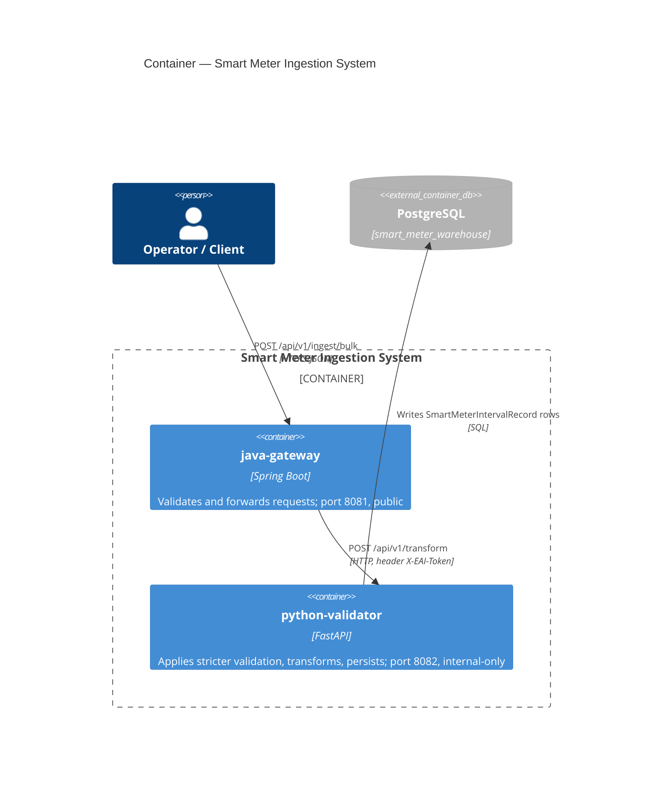

# C4 — Level 2: Container

Shows the two independently deployable units inside the system boundary
from Level 1, and how they talk to each other. "Container" here is the
C4 sense (a separately runnable unit) - not specific to Docker.

