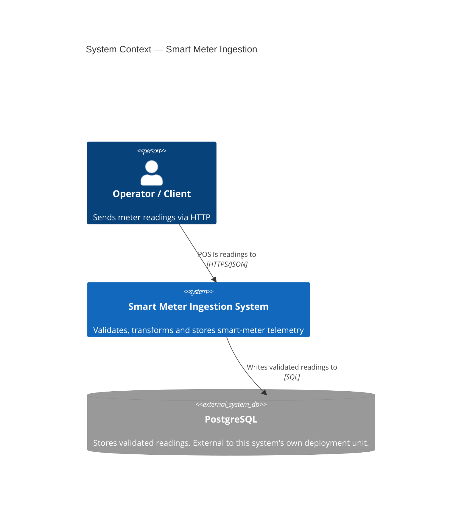

# C4 — Level 1: System Context

Shows the Smart Meter Ingestion system as a single box, and who or what
outside it depends on it or is depended on by it. No internal structure
is shown at this level — that is Level 2, below.

